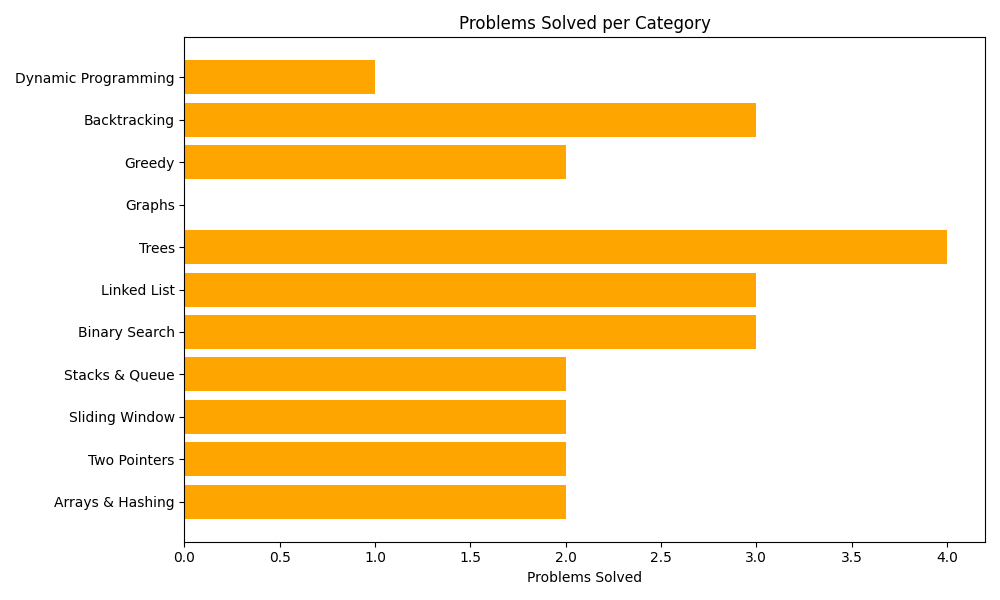

# 🧠 LeetCode DSA Journal


This repository tracks my daily progress solving LeetCode problems. I aim to solve **2 problems every day**, organized by category.

## 📅 Daily Progress

<!-- AUTO-GENERATED-TABLE-START -->
| Day | Problems Solved | Category |
|-----|------------------|----------|
| Day 1 | [Group Anagrams](arrays_hashing/group_anagrams.py), [Two Sum](arrays_hashing/two_sum.py) | Arrays & Hashing |
| Day 2 | [Container With Most Water](two_pointers/container_with_most_water.py), [Valid Palindrome](two_pointers/valid_palindrome.py) | Two Pointers |
| Day 3 | [Best Time Stock](sliding_window/best_time_stock.py), [Longest Unique Substring](sliding_window/longest_unique_substring.py) | Sliding Window |
| Day 4 | [Binary Search](binary_search/binary_search.py), [Search 2D Matrix](binary_search/search_2d_matrix.py) | Binary Search |
| Day 5 | [Search 2D Matrix Ii](binary_search/search_2d_matrix_ii.py), [Linked List Cycle](linked_list/linked_list_cycle.py) | Binary Search / Linked List |
| Day 6 | [Merge Two Sorted Lists](linked_list/merge_two_sorted_lists.py), [Reverse Linked List](linked_list/reverse_linked_list.py) | Linked List |
| Day 7 | [Implement Queue Using Stacks](stack_queue/implement_queue_using_stacks.py), [Valid Parentheses](stack_queue/valid_parentheses.py) | Stacks & Queue |
<!-- AUTO-GENERATED-TABLE-END -->

---

## 📊 Problems per Category



## 📁 Folder Structure

```
leetcode-dsa-journal/
│
├── README.md
├── update_readme.py
│
├── arrays_hashing/
│   ├── two_sum.py
│   └── group_anagrams.py
│
├── two_pointers/
├── sliding_window/
├── stack/
├── binary_search/
├── linked_list/
├── trees/
├── graphs/
├── greedy/
├── backtracking/
└── ...
```

## ✅ Goals
- Solve 2 problems per day
- Categorize by topic
- Maintain clean, commented solutions
- Auto-update progress table after each push 🚀
