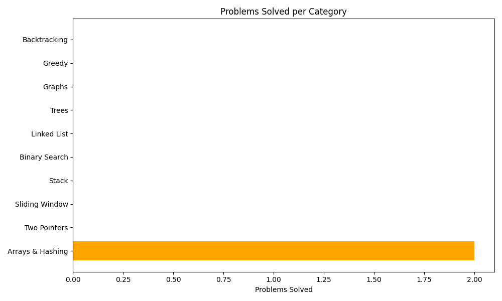

# 👋 Welcome to My LeetCode DSA Journal

This site documents my journey solving 2 LeetCode problems every day.

---

## 📈 Daily Progress Table

See my full progress on [GitHub](https://github.com/YashShelar007/leetcode-dsa-journal#-daily-progress).

---

## 🔍 Problem Categories

- Arrays & Hashing
- Two Pointers
- Sliding Window
- Graphs
- Trees
- Backtracking
- ...

---

## 🚀 Goals

- ✅ Solve 2 problems per day
- ✅ Auto-update README and stats
- ✅ Build a full DSA roadmap

Stay tuned!
